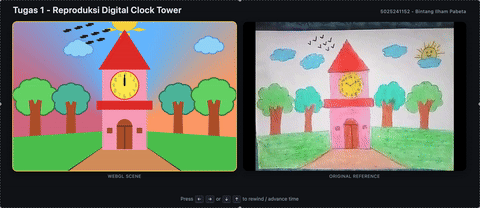

# A01 - Digital Reproduction of a Childhood Illustration

| Student ID | Name |
| :--------: | :--: |
| 5025241152 | Bintang Ilham Pabeta |

## Clock Tower

A WebGL2 recreation of a children's-book style clock tower illustration, built
from scratch without any 3D libraries. The scene runs in real time: the sky
cycles through dawn, day, dusk, and night; the sun and moon orbit; the clouds
drift; and the clock hands keep time.

<p align="center">
    
</p>

## Features

- **Full day/night cycle**, the sky, sun, and moon rotate together around a
  shared pivot. One full turn per 24 simulated hours.
- **Working clock tower**, hour and minute hands track simulated time, with
  hour tick marks and 7-segment numerals 1–12.
- **Animated environment**, drifting clouds, Y-shaped trees with layered
  canopies, distant birds, and a road leading to the tower.
- **Keyboard time control**, arrow keys advance or rewind time; both the sky
  and the clock update live.
- **Side-by-side comparison**, the page shows the WebGL render next to the
  original reference image.

## Controls

| Key | Action |
| :-: | :----- |
| <kbd>→</kbd> / <kbd>↑</kbd> | Advance time forward |
| <kbd>←</kbd> / <kbd>↓</kbd> | Rewind time backward |

## Running Locally

The project uses ES modules, which browsers block over `file://`. Serve the
folder through any static HTTP server.

```bash
# from the project root (the folder containing index.html)
python3 -m http.server 8000
# or
npx serve .
# or
php -S localhost:8000
```